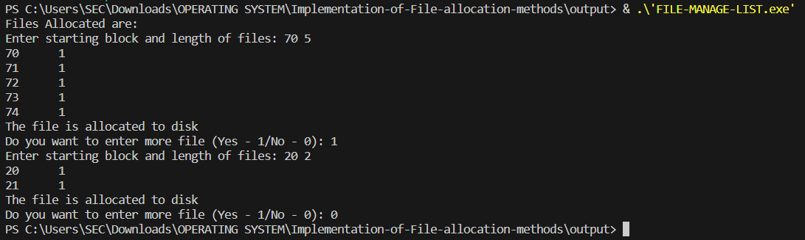
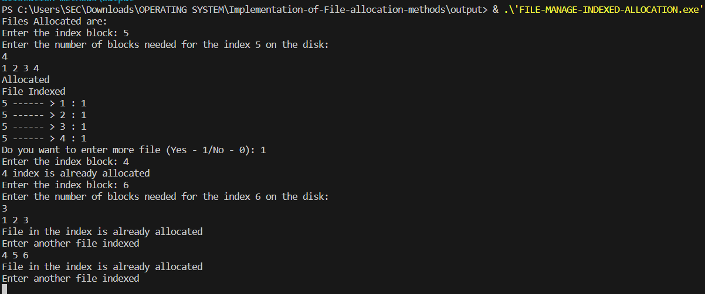
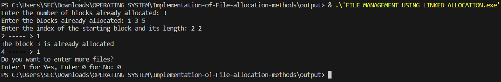

# OS-EX.12-IMPLEMENTATION-OF-FILE-ALLOCATION-METHODS
## 1.FILE MANAGEMENT USING SEQUENTIAL ALLOCATION
## Aim:
To implement file management using sequential list.
## Algorithm:
Step 1: Start the program.   
Step 2: Get the number of memory partition and their sizes.   
Step 3: Get the number of processes and values of block size for each process.  
Step 4: First fit algorithm searches all the entire memory block until a hole which is big enough is encountered. It allocates that memory block for the requesting process.  
Step 5: Best-fit algorithm searches the memory blocks for the smallest hole which can be allocated to requesting process and allocates it.  
Step 6: Worst fit algorithm searches the memory blocks for the largest hole and allocates it to the process.  
Step 7: Analyses all the three memory management techniques and display the best algorithm which utilizes the memory resources effectively and efficiently.  
Step 8: Stop the program.  
## Program:
```c
#include <stdio.h>
int main()
{
    int f[50], i, st, len, j, c, k, count = 0;
    for (i = 0; i < 50; i++)
    {
        f[i] = 0;
    }
    printf("Files Allocated are:\n");
x:
    count = 0;
    printf("Enter starting block and length of files: ");
    scanf("%d %d", &st, &len);
    for (k = st; k < (st + len); k++)
    {
        if (f[k] == 0)
            count++;
    }
    if (len == count) 
    {
        for (j = st; j < (st + len); j++) 
        {
            if (f[j] == 0) 
            {
                f[j] = 1;
                printf("%d\t%d\n", j, f[j]);
            }
        }
        if (j != (st + len - 1))
        {
            printf("The file is allocated to disk\n");
        }
    } 
    else
    {
        printf("The file is not allocated\n");
    }
    printf("Do you want to enter more file (Yes - 1/No - 0): ");
    scanf("%d", &c);
    if (c == 1)
        goto x;
    return 0;
}
```
## Output:

## Result:
Thus, file management using sequential list is implemented successfully.

## 2.FILE MANAGEMENT USING INDEXED ALLOCATION
## Aim:
To implement file management using Indexed list.
## Program:
```c
#include <stdio.h>
#include <stdlib.h>
int main() {
    int f[50], index[50], i, n, st, len, j, c, k, ind, count = 0;
    for (i = 0; i < 50; i++)
    {
        f[i] = 0;
    }
    printf("Files Allocated are:\n");
x:
    printf("Enter the index block: ");
    scanf("%d", &ind);
    if (f[ind] != 1)
    {
        printf("Enter the number of blocks needed for the index %d on the disk: \n", ind);
        scanf("%d", &n);
    } else
    {
        printf("%d index is already allocated\n", ind);
        goto x;
    }
y:
    count = 0;
    for (i = 0; i < n; i++)
    {
        scanf("%d", &index[i]);
        if (f[index[i]] == 0)
        {
            count++;
        }
    }
    if (count == n)
    {
        for (j = 0; j < n; j++)
            f[index[j]] = 1;
        printf("Allocated\n");
        printf("File Indexed\n");
        for (k = 0; k < n; k++)
        {
            printf("%d ------ > %d : %d\n", ind, index[k], f[index[k]]);
        }
    }
    else
    {
        printf("File in the index is already allocated\n");
        printf("Enter another file indexed\n");
        goto y;
    }
    printf("Do you want to enter more file (Yes - 1/No - 0): ");
    scanf("%d", &c);
    if (c == 1)
        goto x;
    else
        return 0;
}
```
## Output:

## Result:
Thus, file management using Indexed list is implemented successfully.

## 3.FILE MANAGEMENT USING LINKED ALLOCATION
## Aim:
To implement file management using Linked list.
## Program:
```c
#include <stdio.h>
#include <stdlib.h>
void recursivePart(int pages[]) 
{
    int st, len, k, c, j;
    printf("Enter the index of the starting block and its length: ");
    scanf("%d %d", &st, &len);
    k = len;
    if (pages[st] == 0)
    {
        for (j = st; j < (st + k); j++) 
        {
            if (pages[j] == 0) 
            {
                pages[j] = 1;
                printf("%d ----- > %d\n", j, pages[j]);
            }
            else 
            {
                printf("The block %d is already allocated\n", j);
                k++;
            }
        }
    } 
    else 
    {
        printf("The block %d is already allocated\n", st);
    }
    printf("Do you want to enter more files?\n");
    printf("Enter 1 for Yes, Enter 0 for No: ");
    scanf("%d", &c);
    if (c == 1)
    {
        recursivePart(pages);
    }
    else
    {
        return;
    }
}
int main() {
    int pages[50], p, a;
    for (int i = 0; i < 50; i++)
    {
        pages[i] = 0;
    }
    printf("Enter the number of blocks already allocated: ");
    scanf("%d", &p);
    printf("Enter the blocks already allocated: ");
    for (int i = 0; i < p; i++) 
    {
        scanf("%d", &a);
        pages[a] = 1;
    }
    recursivePart(pages);
    getchar();
    return 0;
}
```
## Output:

## Result:
Thus, file management using Linked list is implemented successfully.
